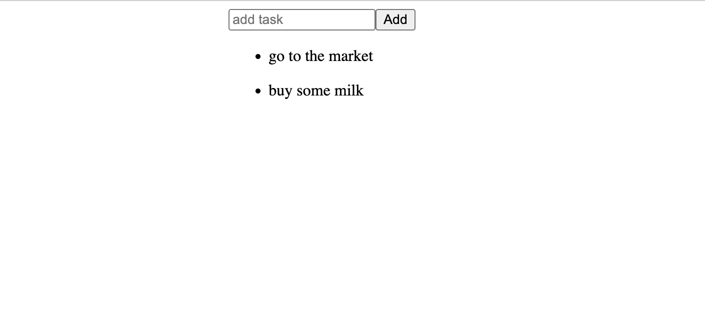
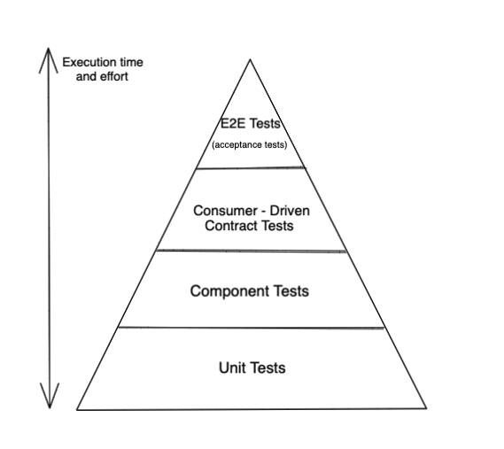

# Vue & Go Simple To-Do List App

# Features
- [x] 1- Todo item can be added 
- [x] 2- Todo list can be listed




## Tech Stack

<ol>
<li> Vue
    <ol>
        <li>axios (API calls)</li>
        <li>unit tests (vue-test-utils)</li>
        <li>e2e tests (puppeteer cucumber)</li>
        <li>consumer driven contract test</li>
    </ol>
</li>

<li>Nginx (Web server)</li>
<li>Docker && Docker-Compose</li>
<li>Gitlab CI/CD Pipeline(CI)
</li>
</ol>

### Tests used in the project



## Project setup
```
yarn install
```

### Compiles and hot-reloads for development
```
yarn serve
```

### Compiles and minifies for production
```
yarn build
```

### Run your unit tests
```
yarn test:unit
yarn test:pact
```

### How to Run?
>Docker must be installed and running already

Run on command line `docker-compose up` in the root project folder

Frontend side will work on 8080 port you can access it too
> sample: localhost: 8080

### OR 
you can reach frontend - https://modanisa-frontend-todo-app.herokuapp.com

